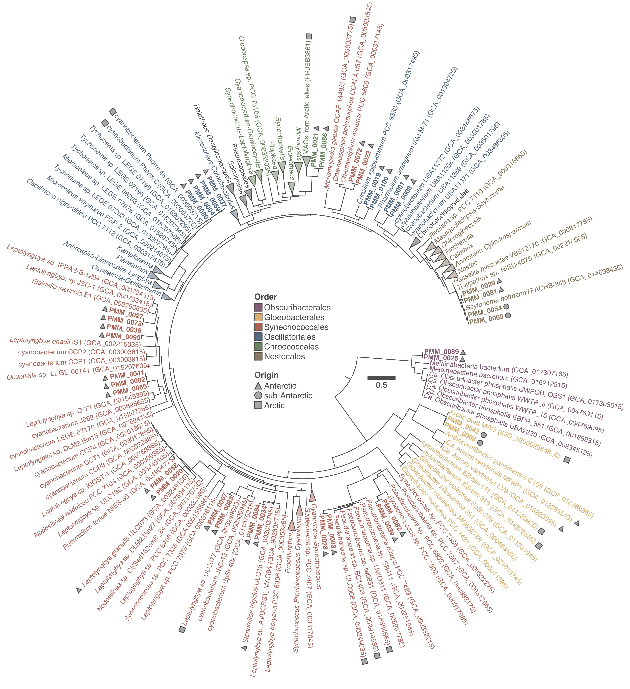

# Polar cyanobacteria MAGs



Bioinformatics workflow used in the article:  

> Pessi IS, Popin RV, Durieu B, Lara Y, Savaglia V, Roncero-Ramos B, Hultman J, Verleyen E, Vyverman W, Wilmotte A. 2023. Novel diversity of polar Cyanobacteria revealed by genome-resolved metagenomics. BioRxiv. doi: [10.1101/2023.02.03.526606](https://doi.org/10.1101/2023.02.03.526606).


## Contacts

**Igor S Pessi**  
Postdoctoral Researcher  
University of Helsinki  
[E-mail](mailto:igor.pessi@gmail.com)

**Annick Wilmotte**  
FRS-FNRS Senior Research Associate  
University of Liège  
[E-mail](mailto:awilmotte@uliege.be)


## Table of contents

1. [Software requirements](#software-requirements)
2. [Download raw sequencing data](#download-raw-sequencing-data)
3. [Check the quality of the raw sequencing data](#check-the-quality-of-the-raw-sequencing-data)
4. [Trim adapters, low-quality base calls, and discard short reads](#trim-adapters-low-quality-base-calls-and-discard-short-reads)
5. [Check the quality of the trimmed data](#check-the-quality-of-the-trimmed-data)
6. [Extract and classify reads matching the 16S rRNA gene](#extract-and-classify-reads-matching-the-16s-rrna-gene)
7. [Assemble the metagenomes](#assemble-the-metagenomes)
8. [Import assemblies to `anvi'o`](#import-assemblies-to-anvio)
9. [Bin MAGs](#bin-mags)
10. [Gather and rename all MAGs](#gather-and-rename-all-mags)
11. [Assign taxonomy to the MAGs](#assign-taxonomy-to-the-mags)
12. [Collect cyanobacteria MAGs](#collect-cyanobacteria-mags)
13. [Import cyanobacteria MAGs to anvi'o](#import-cyanobacteria-mags-to-anvio)
14. [Phylogenomic analysis](#phylogenomic-analysis)
15. [Annotate MAGs](#annotate-mags)
16. [Read recruiment analysis](#read-recruiment-analysis)


## Software requirements

* `GNU parallel`: https://www.gnu.org/software/parallel 
* `SRA Toolkit v3.0.3`: https://github.com/ncbi/sra-tools
* `fastQC v0.11.9`: http://www.bioinformatics.babraham.ac.uk/projects/fastqc
* `multiQC v1.8`: https://multiqc.info
* `Cutadapt v1.16`: https://cutadapt.readthedocs.io
* `METAXA v2.2`: https://microbiology.se/software/metaxa2
* `mothur v1.44.3`: https://mothur.org
* `MEGAHIT v1.1.1.2`: https://github.com/voutcn/megahit
* `anvi’o v7.0`: https://anvio.org
* `GTDB-Tk v1.3.0`: https://github.com/Ecogenomics/GTDBTk
* `ncbi-genome-download v0.3.1`: https://github.com/kblin/ncbi-genome-download
* `IQ-TREE v2.1.4`: http://www.iqtree.org
* `dRep v3.2.2`: https://github.com/MrOlm/drep
* `CoverM v0.6.1`: https://github.com/wwood/CoverM


## Download raw sequencing data

First download the file `sample_metadata.txt` [here](sample_metadata.txt).

```bash
mkdir RAW_DATA

ACCESSIONS=`cut -f 4 sample_metadata.txt | sed '1d'`

for ACCESSION in $ACCESSIONS; do
  fasterq-dump ${ACCESSION} -O RAW_DATA --split-files

  gzip RAW_DATA/${ACCESSION}_1.fastq
  gzip RAW_DATA/${ACCESSION}_2.fastq
done
```


## Check the quality of the raw sequencing data

```bash
mkdir RAW_DATA/FASTQC

fastqc RAW_DATA/*.fastq.gz --outdir RAW_DATA/FASTQC
multiqc RAW_DATA/FASTQC --outdir RAW_DATA/MULTIQC
```


## Trim adapters, low-quality base calls, and discard short reads

```bash
mkdir TRIMMED_DATA

SAMPLES=`cut -f 1 sample_metadata.txt | sed '1d'`

for SAMPLE in $SAMPLES; do
  cutadapt RAW_DATA/${SAMPLE}_R1.fastq.gz \
           RAW_DATA/${SAMPLE}_R2.fastq.gz \
           -o TRIMMED_DATA/${SAMPLE}.R1.fastq.gz \
           -p TRIMMED_DATA/${SAMPLE}.R2.fastq.gz \
           -a CTGTCTCTTATACACATCTCCGAGCCCACGAGAC \
           -A CTGTCTCTTATACACATCTGACGCTGCCGACGA \
           -q 20 \
           -m 50
done
```


## Check the quality of the trimmed data

```bash
mkdir TRIMMED_DATA/FASTQC

fastqc TRIMMED_DATA/*.fastq.gz --outdir TRIMMED_DATA/FASTQC
multiqc FASTQC --outdir TRIMMED_DATA/MULTIQC
```


## Extract and classify reads matching the 16S rRNA gene

```bash
mkdir METAXA

# Find 16S rRNA reads
SAMPLES=`cut -f 1 sample_metadata.txt | sed '1d'`

for SAMPLE in $SAMPLES; do
  metaxa2 -1 TRIMMED_DATA/${SAMPLE}.R1.fastq.gz \
          -2 TRIMMED_DATA/${SAMPLE}.R2.fastq.gz \
          -o METAXA/${SAMPLE} \
          --align none \
          --graphical F \
          --plus
done

# Download SILVA database formatted for mothur
wget https://mothur.s3.us-east-2.amazonaws.com/wiki/silva.nr_v138_1.tgz
tar zxf silva.nr_v138_1.tgz

# Classify sequences
for SAMPLE in $SAMPLES; do
  mothur "#classify.seqs(fasta=METAXA/${SAMPLE}.bacteria.fasta, template=silva.nr_v138_1.align, taxonomy=silva.nr_v138_1.tax, probs=F)"
  mothur "#classify.seqs(fasta=METAXA/${SAMPLE}.archaea.fasta,  template=silva.nr_v138_1.align, taxonomy=silva.nr_v138_1.tax, probs=F)"
done
```


## Assemble the metagenomes

### Individual assemblies

```bash
mkdir ASSEMBLIES

SAMPLES=`cut -f 1 sample_metadata.txt | sed '1d'`

for SAMPLE in $SAMPLES; do
  megahit -1 TRIMMED_DATA/${SAMPLE}.R1.fastq.gz \
          -2 TRIMMED_DATA/${SAMPLE}.R2.fastq.gz \
          --out-dir ASSEMBLIES/${SAMPLE} \
          --min-contig-len 1000
done
```

### Co-assemblies

```bash
for ASSEMBLY in ANT ARC; do
  # List samples
  if [[ ${ASSEMBLY} == "ANT" ]]; then
    SAMPLES=`awk -F '\t' '{if($2 == "Maritime Antarctica" || $2 == "Transantarctic Mountains" || $2 == "East Antarctica") {print $1}}' sample_metadata.txt`
  fi

  if [[ ${ASSEMBLY} == "ARC" ]]; then
    SAMPLES=`awk -F '\t' '{if($2 == "Arctic" || $2 == "sub-Antarctic") {print $1}}' sample_metadata.txt`
  fi

  # Get path to fastq files
  R1=`printf '%s\n' ${SAMPLES} | awk -v ORS="," '{print "TRIMMED_DATA/" $0 ".R1.fastq.gz"}' | sed 's/,$/\n/'`
  R2=`printf '%s\n' ${SAMPLES} | awk -v ORS="," '{print "TRIMMED_DATA/" $0 ".R2.fastq.gz"}' | sed 's/,$/\n/'`

  # Assemble
  megahit -1 ${R1} \
          -2 ${R2} \
          --out-dir ASSEMBLIES/CO_${ASSEMBLY} \
          --min-contig-len 1000
done
```


## Import assemblies to `anvi'o`

```bash
mkdir BINNING

ASSEMBLIES=`ls ASSEMBLIES | grep -v 'Forlidas11'`
SAMPLES=`cut -f 1 sample_metadata.txt | sed '1d' | grep -v 'Forlidas11'`

for ASSEMBLY in $ASSEMBLIES; do
  mkdir BINNING/${ASSEMBLY}

  # Rename contigs and select those >2,500 bp
  anvi-script-reformat-fasta ASSEMBLIES/${ASSEMBLY}/final.contigs.fa \
                             --output-file BINNING/${ASSEMBLY}/CONTIGS_2500nt.fa \
                             --report-file BINNING/${ASSEMBLY}/CONTIGS_reformat.txt \
                             --prefix ${ASSEMBLY} \
                             --min-len 2500 \
                             --simplify-names

  # Build a contigs database
  anvi-gen-contigs-database --contigs-fasta BINNING/${ASSEMBLY}/CONTIGS_2500nt.fa \
                            --output-db-path BINNING/${ASSEMBLY}/CONTIGS.db \
                            --project-name ${ASSEMBLY}

  # Find single-copy genes
  anvi-run-hmms --contigs-db BINNING/${ASSEMBLY}/CONTIGS.db

  # Get taxonomy for single copy genes
  anvi-run-scg-taxonomy --contigs-db BINNING/${ASSEMBLY}/CONTIGS.db

  # Map short reads
  mkdir BINNING/${ASSEMBLY}/MAPPING

  bowtie2-build BINNING/${ASSEMBLY}/CONTIGS_2500nt.fa BINNING/${ASSEMBLY}/MAPPING/${ASSEMBLY}.contigs

  for SAMPLE in $SAMPLES; do
    bowtie2 -1 TRIMMED_DATA/${SAMPLE}.R1.fastq.gz \
            -2 TRIMMED_DATA/${SAMPLE}.R2.fastq.gz  \
            -S BINNING/${ASSEMBLY}/MAPPING/${SAMPLE}.sam \
            -x BINNING/${ASSEMBLY}/MAPPING/${ASSEMBLY}.contigs \
            --no-unal

    samtools view -F 4 -bS BINNING/${ASSEMBLY}/MAPPING/${SAMPLE}.sam | samtools sort > BINNING/${ASSEMBLY}/MAPPING/${SAMPLE}.bam
    samtools index BINNING/${ASSEMBLY}/MAPPING/${SAMPLE}.bam
  done

  # Build profile databases
  mkdir BINNING/${ASSEMBLY}/PROFILES

  for SAMPLE in $SAMPLES; do
    anvi-profile --input-file BINNING/${ASSEMBLY}/MAPPING/${SAMPLE}.bam \
                 --output-dir BINNING/${ASSEMBLY}/PROFILES/${SAMPLE} \
                 --contigs-db BINNING/${ASSEMBLY}/CONTIGS.db
  done

  # Merge profiles
  anvi-merge BINNING/${ASSEMBLY}/PROFILES/*/PROFILE.db \
             --output-dir BINNING/${ASSEMBLY}/MERGED_PROFILES \
             --contigs-db BINNING/${ASSEMBLY}/CONTIGS.db \
             --enforce-hierarchical-clustering
done
```


## Bin MAGs

```bash
ASSEMBLIES=`ls ASSEMBLIES | grep -v 'Forlidas11'`

for ASSEMBLY in $ASSEMBLIES; do
  # Bin MAGs
  anvi-interactive --profile-db BINNING/${ASSEMBLY}/MERGED_PROFILES/PROFILE.db \
                   --contigs-db BINNING/${ASSEMBLY}/CONTIGS.db

  # Call MAGs
  anvi-rename-bins --profile-db BINNING/${ASSEMBLY}/MERGED_PROFILES/PROFILE.db \
                   --contigs-db BINNING/${ASSEMBLY}/CONTIGS.db \
                   --report-file BINNING/${ASSEMBLY}/renamed_bins.txt \
                   --collection-to-read default \
                   --collection-to-write final \
                   --min-completion-for-MAG 50 \
                   --max-redundancy-for-MAG 10 \
                   --prefix ${ASSEMBLY} \
                   --call-MAGs

  # Refine MAGs
  for MAG in `sqlite3 BINNING/${ASSEMBLY}/MERGED_PROFILES/PROFILE.db 'SELECT bin_name FROM collections_bins_info WHERE collection_name LIKE "final"' | grep MAG`; do
    anvi-refine --profile-db BINNING/${ASSEMBLY}/MERGED_PROFILES/PROFILE.db \
                --contigs-db BINNING/${ASSEMBLY}/CONTIGS.db \
                --collection-name final \
                --bin-id ${MAG}
  done

  # Summarise MAGs
  anvi-summarize --contigs-db BINNING/${ASSEMBLY}/CONTIGS.db \
                 --pan-or-profile-db BINNING/${ASSEMBLY}/MERGED_PROFILES/PROFILE.db \
                 --output-dir BINNING/${ASSEMBLY}/SUMMARY \
                 --collection-name final
done
```


## Gather and rename all MAGs

```bash
mkdir BINNING/FINAL_MAGs

PREFIX=PMM
COUNT=0

ASSEMBLIES=`ls ASSEMBLIES | grep -v 'Forlidas11'`

for ASSEMBLY in $ASSEMBLIES; do
  for MAG in `sqlite3 BINNING/${ASSEMBLY}/MERGED_PROFILES/PROFILE.db 'SELECT bin_name FROM collections_bins_info WHERE collection_name LIKE "final"' | grep MAG`; do
    COUNT=`expr ${COUNT} + 1`
    NEW_NAME=`printf '%s_%04d\n' ${PREFIX} ${COUNT}`

    printf '%s\t%s\n' ${MAG} ${NEWMAG} >> BINNING/FINAL_MAGs/renamed_MAGs.txt

    anvi-script-reformat-fasta BINNING/${ASSEMBLY}/SUMMARY/bin_by_bin/${MAG}/${MAG}-contigs.fa \
                               --output-file BINNING/FINAL_MAGs/${NEW_NAME}.fa \
                               --prefix ${NEW_NAME} \
                               --simplify-names
  done
done
```


## Assign taxonomy to the MAGs

```bash
gtdbtk classify_wf --genome_dir BINNING/FINAL_MAGs \
                   --out_dir BINNING/FINAL_MAGs_GTDB \
                   --extension fa
```


## Collect cyanobacteria MAGs

```bash
mkdir CYANO_MAGs
mkdir CYANO_MAGs/REDUNDANT_MAGs

CYANO_MAGs=`grep p__Cyanobacteria BINNING/FINAL_MAGs_GTDB/gtdbtk.bac120.summary.tsv | cut -f 1`

for MAG in $CYANO_MAGs; do
  cp BINNING/FINAL_MAGs/${MAG}.fa > CYANO_MAGs/REDUNDANT_MAGs/${MAG}.fa
done
```

Alternatively, you can download the set of 37 cyanobacteria MAGs used in our study [here](https://doi.org/10.6084/m9.figshare.22003967).


## Import cyanobacteria MAGs to `anvi'o`

```bash
# Concatenate MAGs
cat CYANO_MAGs/REDUNDANT_MAGs/*.fa > CYANO_MAGs/CONTIGS.fa

# Build a contigs database
anvi-gen-contigs-database --contigs-fasta CYANO_MAGs/CONTIGS.fa \
                          --output-db-path CYANO_MAGs/CONTIGS.db \
                          --project-name CYANO_MAGs

# Find single-copy genes
anvi-run-hmms --contigs-db CYANO_MAGs/CONTIGS.db

# Map short reads
mkdir CYANO_MAGs/MAPPING

bowtie2-build CYANO_MAGs/CONTIGS.fa CYANO_MAGs/MAPPING/contigs

SAMPLES=`cut -f 1 sample_metadata.txt | sed '1d' | grep -v 'Forlidas11'`

for SAMPLE in $SAMPLES; do
  bowtie2 -1 TRIMMED_DATA/${SAMPLE}.R1.fastq.gz \
          -2 TRIMMED_DATA/${SAMPLE}.R2.fastq.gz  \
          -S CYANO_MAGs/MAPPING/${SAMPLE}.sam \
          -x CYANO_MAGs/MAPPING/contigs \
          --threads 40 \
          --no-unal

  samtools view -F 4 -bS CYANO_MAGs/MAPPING/${SAMPLE}.sam | samtools sort > CYANO_MAGs/MAPPING/${SAMPLE}.bam
  samtools index CYANO_MAGs/MAPPING/${SAMPLE}.bam
done

# Build profile databases
mkdir CYANO_MAGs/PROFILES

for SAMPLE in $SAMPLES; do
  anvi-profile --input-file CYANO_MAGs/MAPPING/${SAMPLE}.bam \
               --output-dir CYANO_MAGs/PROFILES/${SAMPLE} \
               --contigs-db CYANO_MAGs/CONTIGS.db
done

# Merge profiles
anvi-merge CYANO_MAGs/PROFILES/*/PROFILE.db \
            --output-dir CYANO_MAGs/MERGED_PROFILE \
            --contigs-db CYANO_MAGs/CONTIGS.db \
            --enforce-hierarchical-clustering

# Create map of splits to MAGs
for SPLIT in `sqlite3 CYANO_MAGs/CONTIGS.db 'SELECT split FROM splits_basic_info'`; do
  MAG=`echo $SPLIT | sed -E 's/_[0-9]+_split_[0-9]+//'`

  printf '%s\t%s\n' $SPLIT $MAG
done > CYANO_MAGs/CONTIGS_info.txt

# Import collection
anvi-import-collection CYANO_MAGs/CONTIGS_info.txt \
                       --contigs-db CYANO_MAGs/CONTIGS.db \
                       --pan-or-profile-db CYANO_MAGs/MERGED_PROFILE/PROFILE.db \
                       --collection-name CYANO_MAGs

# Summarize redundant MAGs
anvi-summarize --contigs-db CYANO_MAGs/CONTIGS.db \
               --pan-or-profile-db CYANO_MAGs/MERGED_PROFILE/PROFILE.db \
               --output-dir CYANO_MAGs/SUMMARY \
               --collection-name CYANO_MAGs
```


## Phylogenomic analysis

### Download all genomes of cyanobacteria in GenBank

```bash
mkdir CYANO_MAGs/PHYLOGENOMICS

gimme_taxa.py 1798711 \
              -o CYANO_MAGs/PHYLOGENOMICS/NCBI_genomes_taxids.txt \
              --just-taxids

ncbi-genome-download bacteria \
                     --output-folder CYANO_MAGs/PHYLOGENOMICS/GENOMES \
                     --metadata CYANO_MAGs/PHYLOGENOMICS/NCBI_genomes_metadata.txt \
                     --taxid CYANO_MAGs/PHYLOGENOMICS/NCBI_genomes_taxids.txt \
                     --format fasta \
                     --section genbank \
                     --parallel 10 \
                     --retries 1

# Unzip
GENOMES=`ls CYANO_MAGs/PHYLOGENOMICS/GENOMES/`

for GENOME in $GENOMES; do
  gunzip -c $GENOME
done
```

### Import GenBank genomes to anvi'o

```bash
GENOMES=`ls CYANO_MAGs/PHYLOGENOMICS/GENOMES/ | sed 's/\.fa//'`

mkdir CYANO_MAGs/PHYLOGENOMICS/CONTIGSDB

printf '%s\n' `echo $GENOMES` |
parallel -I % --bar --max-args 1 'anvi-script-reformat-fasta CYANO_MAGs/PHYLOGENOMICS/GENOMES/%.fa \
                                                             --output-file CYANO_MAGs/PHYLOGENOMICS/CONTIGSDB/%.fa \
                                                             --report-file CYANO_MAGs/PHYLOGENOMICS/CONTIGSDB/%.reformat.txt \
                                                             --simplify-names'

printf '%s\n' `echo $GENOMES` |
parallel -I % --bar --max-args 1 'anvi-gen-contigs-database --contigs-fasta CYANO_MAGs/PHYLOGENOMICS/CONTIGSDB/%.fa \
                                                            --output-db-path CYANO_MAGs/PHYLOGENOMICS/CONTIGSDB/%.db'

printf '%s\n' `echo $GENOMES` |
parallel -I % --bar --max-args 1 'anvi-run-hmms --contigs-db CYANO_MAGs/PHYLOGENOMICS/CONTIGSDB/%.db'
```

### Make lists of genomes for phylogenomics

```bash
# GenBank
printf '%s\t%s\n' name contigs_db_path > CYANO_MAGs/PHYLOGENOMICS/external_genomes.txt

for GENOME in $GENOMES; do
  NAME=`echo ${GENOME} | sed 's/\.[0-9]//'`

  printf '%s\t%s\n' ${NAME} ${PWD}/CYANO_MAGs/PHYLOGENOMICS/CONTIGSDB/${GENOME}.db
done >> CYANO_MAGs/PHYLOGENOMICS/external_genomes.txt

# MAGs
MAGs=`cut -f 2 CYANO_MAGs/CONTIGS_info.txt | sort | uniq`

printf '%s\t%s\t%s\t%s\t%s\n' name bin_id collection_id profile_db_path contigs_db_path > CYANO_MAGs/PHYLOGENOMICS/internal_genomes.txt

for MAG in $MAGs; do
  printf '%s\t%s\t%s\t%s\t%s\n' ${MAG} ${MAG} CYANO_MAGs ${PWD}/CYANO_MAGs/PROFILE/PROFILE.db ${PWD}/CYANO_MAGs/CONTIGS.db
done >> CYANO_MAGs/PHYLOGENOMICS/internal_genomes.txt
```

### Build phylogenomic tree

```bash
# Make list of genes
RIBO_GENES="Ribosom_S12_S23,Ribosomal_L1,Ribosomal_L13,Ribosomal_L14,Ribosomal_L16,Ribosomal_L17,Ribosomal_L18p,Ribosomal_L19,Ribosomal_L2,Ribosomal_L20,Ribosomal_L21p,Ribosomal_L22,Ribosomal_L23,Ribosomal_L27,Ribosomal_L27A,Ribosomal_L28,Ribosomal_L29,Ribosomal_L3,Ribosomal_L32p,Ribosomal_L35p,Ribosomal_L4,Ribosomal_L5,Ribosomal_L6,Ribosomal_L9_C,Ribosomal_S10,Ribosomal_S11,Ribosomal_S13,Ribosomal_S15,Ribosomal_S16,Ribosomal_S17,Ribosomal_S19,Ribosomal_S2,Ribosomal_S20p,Ribosomal_S3_C,Ribosomal_S6,Ribosomal_S7,Ribosomal_S8,Ribosomal_S9"

# Get amino acid sequences
anvi-get-sequences-for-hmm-hits --external-genomes CYANO_MAGs/PHYLOGENOMICS/external_genomes.txt \
                                --internal-genomes CYANO_MAGs/PHYLOGENOMICS/internal_genomes.txt \
                                --output-file CYANO_MAGs/PHYLOGENOMICS/ribosomal.faa \
                                --hmm-source Bacteria_71 \
                                --gene-names ${RIBO_GENES} \
                                --get-aa-sequences \
                                --concatenate-genes \
                                --return-best-hit

# Build tree
iqtree -s CYANO_MAGs/PHYLOGENOMICS/ribosomal.faa \
       -B 1000 \
       --prefix CYANO_MAGs/PHYLOGENOMICS/ribosomal
```

### Calculate ANI

```bash
anvi-compute-genome-similarity --external-genomes CYANO_MAGs/PHYLOGENOMICS/external_genomes.txt \
                               --internal-genomes CYANO_MAGs/PHYLOGENOMICS/internal_genomes.txt \
                               --output-dir CYANO_MAGs/PHYLOGENOMICS/FASTANI \
                               --program fastANI \
```


## Annotate MAGs

```bash
# KEGG KOfam
anvi-run-kegg-kofams --contigs-db CYANO_MAGs/CONTIGS.db

# NCBI COG
anvi-run-ncbi-cogs --contigs-db CYANO_MAGs/CONTIGS.db

# Pfam
anvi-run-pfams --contigs-db CYANO_MAGs/CONTIGS.db
```


## Read recruiment analysis

```bash
# Dereplicate MAGs
dRep dereplicate CYANO_MAGs/READ_RECRUITMENT --genomes CYANO_MAGs/REDUNDANT_MAGs/*.fa

# Get the relative abundance of non-redundant MAGs
coverm genome -1 TRIMMED_DATA/*.R1.fastq \
              -2 TRIMMED_DATA/*.R2.fastq \
              --genome-fasta-files CYANO_MAGs/READ_RECRUITMENT/dereplicated_genomes/*.fa \
              --output-file CYANO_MAGs/READ_RECRUITMENT/coverM.txt \
              --min-read-percent-identity 95 \
              --min-read-aligned-percent 75
```
